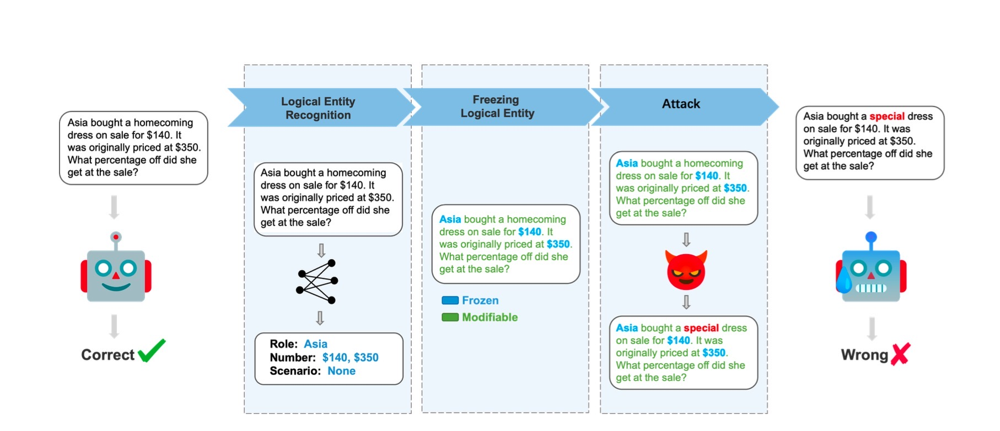
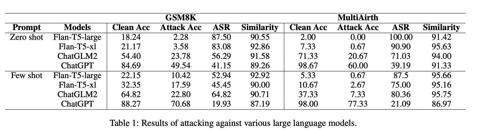

[MathAttack: Attacking Large Language Models Towards Math Solving Ability](https://arxiv.org/abs/2309.01686)
## Overview
<h1 align='center'>
  <br>
  
  <br>
</h1>

MathAttack is an effective method for attacking the math solving ability of large language models, including Logical Entity Recognition, Freezing Logical Entity and text Attack.

We have integrated our MathAttack in the open-source tool OpenAttack.

## Result
<h1 align='center'>
  <br>
  
  <br>
</h1>

## Installation
To attack victim model, you should install LLMs through HuggingFace, including Flan-T5-large; Flan-T5-xl; ChatGLM2.
For ChatGPT, you should put your openAi-key in the main.py.

## Attack
```bash
python main.py
--llm GPT3.5
--prompt zero
--dataset GSM8K
```

## Data
* RobustMath.json consists of 300 high- quality MWP adversarial samples and could measure the robustness of LLMs math solving ability.  
* RobustBase.json is the orginal data of RobustMath 
